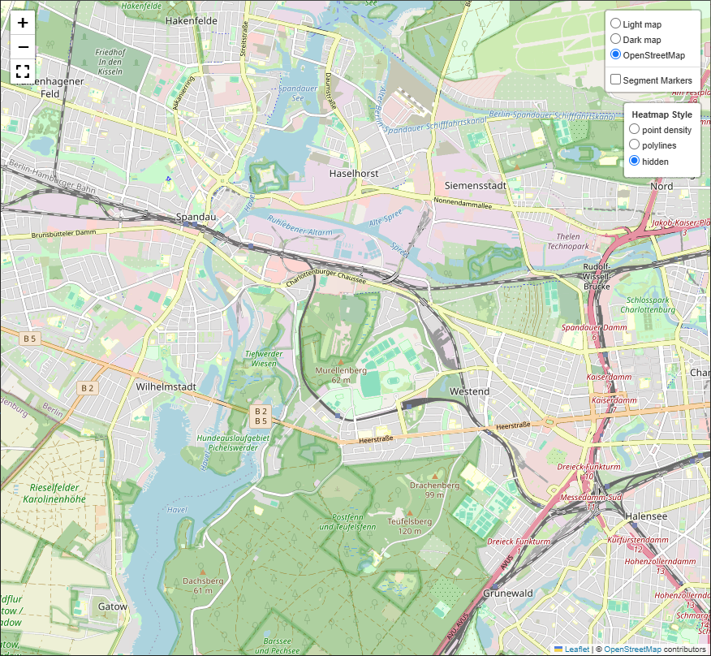
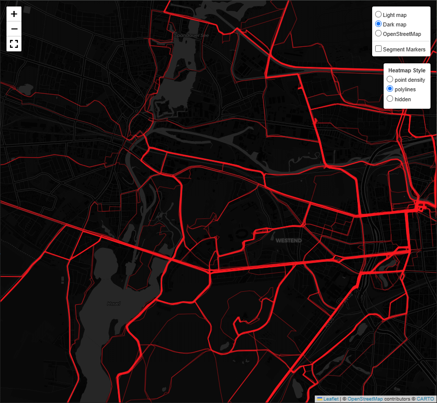
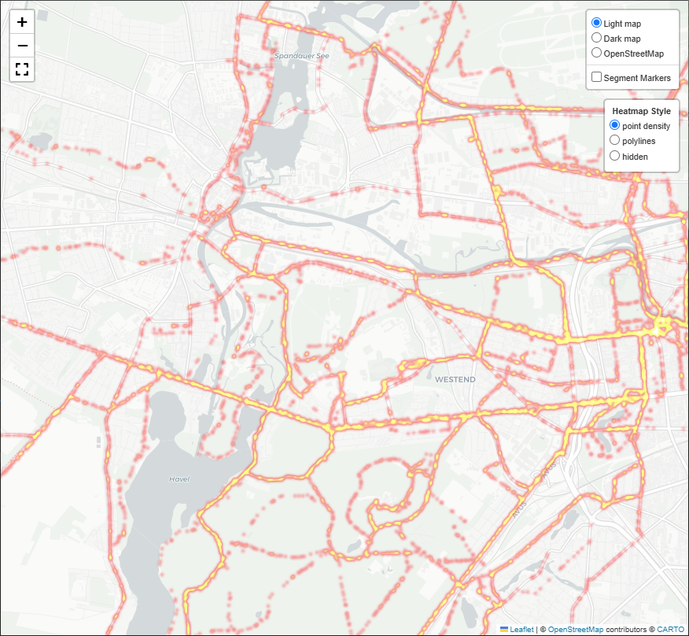
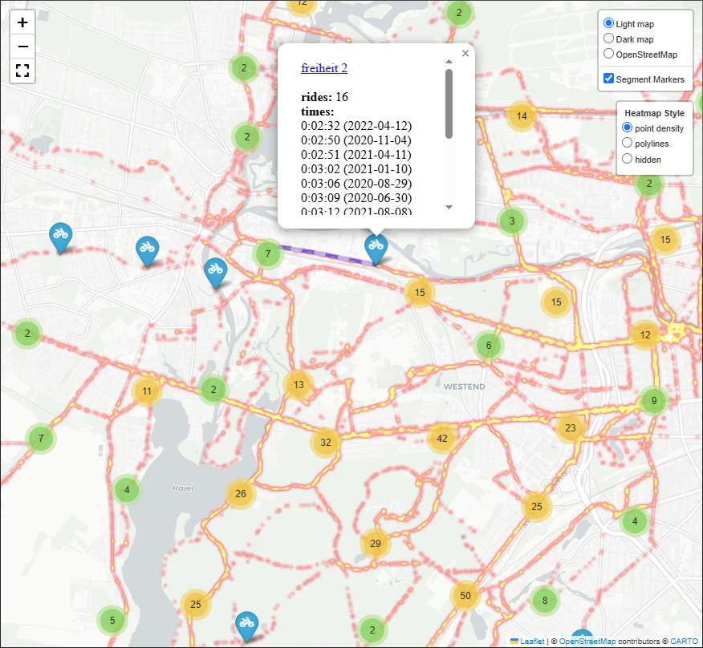

# Bike Beacon Map
This will grab the athletes rides / activities from strava and generate a map in html format. The map has different styles to select, it contains your global heatmap in density or polyline style and a marker for each segment ever ridden with your personal efforts listed in a tooltip.  
To use this script you need an "app", created in *your* strava account to be able to fetch your data.


> Warning: This readme is probably not complete and may perhaps skip steps which are not obviously to beginners. To be honest, it is more a list of reminders for myself 🙈😬

## Output Example
The generated map has various styles and overlays to select.  








There is one known issue: When heatmap style is "polylines" and you click a marker the polylines disappear. I have not yet tried to fix that.

## Virtual environment
```
py -m venv .venv

./.venv/Scripts/Activate.ps1

pip install pandas
pip install requests
pip install folium
pip install matplotlib
```

## Setup / first start (register own API access)
This is designed to use an API access from strava, you have to create that in your settings:  
https://www.strava.com/settings/api  
* You will get a client id and a client secret, which is necessary to access your data on strava. Copy this id and secret to a file `client.json` with following content:
    ```
    {"application": "YourApplicationName", "id": "12345", "secret": "aVeryLongStringFromNumbersAndLetters"}
    ```

* Visit this link in your browser and accept your app to access data (change the client_id to your own):  
https://www.strava.com/oauth/authorize?client_id=12345&redirect_uri=http://localhost&response_type=code&scope=activity:read_all  

* Your browsers adress line will change. Copy the part behind `code=` from browsers adress line and paste it somewhere. Lets call that **supercode**

* Use **client_secret** and **supercode** with the python snippet below (also change to your **client_id**)
    ```
    import requests

    supercode = 'aVeryLongCodeWithNumbersAndLetters'
    url = 'https://www.strava.com/oauth/token?client_id=12345&client_secret=anotherVeryLongCodeWithNumbersAndLetters&code='+supercode+'&grant_type=authorization_code'
    response = requests.post(url)
    access_refresh = response.json()
    with open('access_refresh.json', 'w') as f:
        json.dump(access_refresh, f)
    ```
    This should have written a file called `access_refresh.json` when executed.  

* You never have to care about all that again, the access token will refresh automatically


## Usage
run `createBeaconMap.py` and you will get your `BikeBeaconMap.html`
> If you have lots of rides, you probably will get a rate limit from strava and due to that an error from script. CUrrently there is no handling for that implemented, as I started with a few activities and now have my data stored local and just fetch some new activities. But, you may store data step by step while debugging. Sorry for that inconvenience.


#### local data files
BikeBeaconRidesData.pickle  
BikeBeaconEffortsData.pickle


